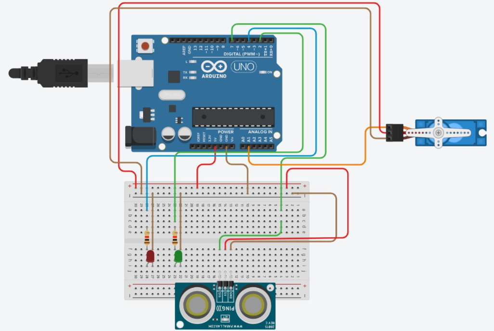

# Smart Parking Barrier System (Arduino Project)

  
  
  

---

## Overview

This project simulates a smart parking entrance barrier using an Arduino board, an infrared obstacle sensor, a servo motor, and LED indicators.

The system mimics a real parking gate:

* Green LED indicates that access is free (no car detected)
* Red LED indicates that a car is detected
* The servo motor controls the barrier position

---

## Circuit Diagram

  

---

## Demonstration Video

  <video width="500" controls>
    <source src="circuitvideo.mp4" type="video/mp4">
  </video>

---

## Components Used

* Arduino UNO
* Servo Motor (used as barrier mechanism)
* Infrared Obstacle Sensor (proximity detection)
* 2 LEDs:
  * Green LED (free access)
  * Red LED (car detected)
* Resistors (for LED protection)
* Breadboard
* Jumper wires

---

## System Behavior

### No Obstacle Detected
* Sensor output is HIGH (1)
* Green LED blinks
* Red LED is OFF
* Servo moves to the closed position (barrier down)

### Obstacle Detected (Car Present)
* Sensor output is LOW (0)
* Red LED turns ON
* Green LED is OFF
* Servo rotates to open the barrier

---

## Pin Configuration

| Component       | Arduino Pin |
|----------------|-------------|
| Infrared Sensor | 7           |
| Green LED      | 2           |
| Red LED        | 4           |
| Servo Motor    | A1          |

---

## Code Explanation

### Libraries
* `Servo.h` – used to control the servo motor

### Variables
* `senzor` – input pin for infrared sensor
* `verde` – green LED pin
* `rosu` – red LED pin
* `rot` – state variable to prevent repeated rotation

### Functions

#### `setup()`
* Initializes pins
* Attaches servo to pin A1
* Sets initial servo position (90 degrees)
* Starts serial communication

#### `Roteste_Dreapta()`
* Rotates servo gradually from 0 to 180 degrees
* Simulates opening the barrier
* Runs only once per detection

#### `Roteste_Stanga()`
* Moves servo back to closed position (0 degrees)

#### `Aprinde_Verde()`
* Blinks green LED to indicate free access

#### `loop()`
* Reads sensor continuously
* If obstacle detected:
  * Red LED ON
  * Barrier opens
* If no obstacle:
  * Green LED blinks
  * Barrier closes

---

## Notes

* Uses infrared obstacle sensor instead of ultrasonic sensor
* Detects objects based on reflected IR light
* Designed and tested in Tinkercad

---

## Possible Improvements

* Replace IR sensor with ultrasonic sensor for better accuracy
* Add buzzer for sound alerts
* Add LCD display for system status
* Add automatic delay-based closing system

---

## Author

**Maria-Daria Tompea**
